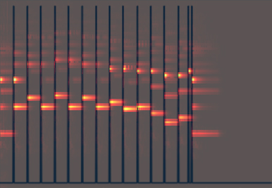
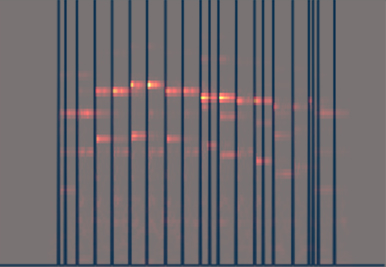
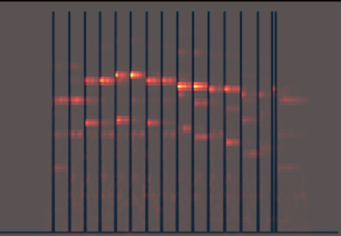

# 04/13/2019 周报  
---  
  
## 总结  
### CNN Polyphonic 音高识别  
本阶段polyphonic的研究限定在两个音。  
进行多次不同类实验，目标、结果与所用数据集大致描述如下：  

|实验|结果|数据集|  
|:---:|:---:|:---:|  
|训练一维label的CNN，通过设定概率阈值，将概率较大的一个或几个label输出作为结果|对单个音的图片识别准确率很高，对多个音的识别准确率较低|  C4-A4的六个音，每个音288张不同的图片，包括不同音值、强度、乐器|  
|训练多维label的CNN|对单音与两个音的识别效果都很好，但缺陷在于需要提前给定本次输出为几个标签|  上述六个音的数据集以及其排列组合15中双音各自对应的88张不同的图片|  
|训练多维label的CNN，取概率平均值为阈值，尝试解决输入图片中音符数不确定的问题|正在试验|同上|    

> 上述“效果较好”为准确率在99%~100%  

### 音符起点检测  
简单实现了论文[基于常量Q变换的音符起始点检测](http://www.ecice06.com/CN/article/downloadArticleFile.do?attachType=PDF&id=25158)中提出的算法，对于不同的音频输入检测有一定的准确率。  
- 对于MIDI文件导出生成的wav文件，由于其波形较为规则，常数Q变换后生成的分音矩阵以及频谱图也较为规则，识别结果较好。  
- 对于自然音源，由于波形较为复杂，且音符强弱变化更为复杂，识别结果相对较差。  

下图为上述两种情况分别对应的频谱图与检测出的音符起始点的图片叠加对比。  
  
|wav音源|时频图与音符起始点检测结果叠加图|  
|:---:|:---:|  
|MIDI文件导出wav||  
|自然演奏wav||   
|自然演奏wav-修正判定阈值||  

### MIDI文件整合  
- 学习开源项目[melo](https://github.com/Mistodon/melo)与Rust语言  
- 准备设计整合文件格式  

  
## 下一步目标  
### CNN  
将训练范围由六个note扩大至C3、C4两个八度中的24个音。  

### 音符起点检测  
寻找试验更好的阈值判定算法，以其获得根据音源自适应的阈值，提高准确率。  

### 结果生成展示  
设计接收文件格式以接收上述两步的结果。  